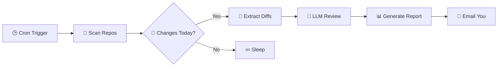

# Code Review Agent (CRA)


[](https://github.com/juparave/codereviewer)

> **Your personal senior engineer that works while you sleep.** 🌙

CRA is a CLI tool written in **Go** that performs automated nightly code reviews. It scans your local Git repositories, identifies meaningful changes, and uses LLMs (Gemini/Zhipu) to find bugs, security issues, and improvements.

---

## 🚀 How It Works



## ✨ Features

- **🔍 Auto-Discovery**: Recursively finds all Git repositories in your workspace.
- **🧠 AI-Powered**: Uses **Google Gemini 2.0** or **Zhipu GLM-4** for deep code analysis.
- **⚡ Smart Diffing**: Ignores noise (vendor files, lockfiles) and focuses on logic.
- **📊 Rich Reporting**: Generates beautiful Markdown/HTML reports with severity grading.
- **⏰ Flexible Timing**: Review today's work or the last `24h`/`7d` with the `--since` flag.
- **🔔 Notifications**: Delivers directly to your inbox so you start your day with insights.

## 📦 Installation

### From Source

```bash
git clone https://github.com/juparave/codereviewer.git
cd codereviewer
go install ./cmd/review
# Binary is now typically in ~/go/bin/review
```

### Build Locally

```bash
go build -o cra ./cmd/review
./cra --version
```

## ⚙️ Configuration

CRA looks for `~/.config/cra/config.yaml`.

### 1. Gemini (Default & Recommended)

```yaml
root_path: ~/workspace
since: "24h" # Review last 24 hours

review:
  provider: googleai
  model: gemini-2.0-flash
  # api_key: ... (or usage export GEMINI_API_KEY)

email:
  enabled: true
  to_address: me@example.com
  # ... (see config.example.yaml)
```

### 2. Zhipu AI (OpenAI Compatible)

```yaml
review:
  provider: openai
  model: glm-4.7
  base_url: https://open.bigmodel.cn/api/paas/v4/
  # api_key: ... (or export ZHIPU_API_KEY)
```

## 🛠️ Usage

| Command | Description |
| :--- | :--- |
| `cra` | Review changes from **today** (since 00:00) |
| `cra --since 24h` | Review changes from the **last 24 hours** |
| `cra --dry-run` | Generate report but **skip email** |
| `cra --verbose` | Show detailed logs (files scanned, model used) |

## 🤖 Automation

Add this to your `crontab -e` to run every night at **2 AM**:

```bash
0 2 * * * cd ~/workspace/codereviewer && export GEMINI_API_KEY="key" && ./cra --config ~/.config/cra/config.yaml >> /tmp/cra.log 2>&1
```

## 📂 Project Structure

```text
codereviewer/
├── cmd/             # CLI entrypoints
├── internal/
│   ├── app/         # Orchestration logic
│   ├── git/         # Git plumbing
│   ├── review/      # LLM integration (Genkit)
│   └── report/      # Markdown/HTML formatting
└── reports/         # Output directory for daily reports
```

## 📜 License

MIT © [Juparave](https://github.com/juparave)
